# HealthCalc Project  

## Practica 1
## Project Description  
HealthCalc is a Java application that calculates ideal weight and basal metabolic rate (BMR) based on user input. The project follows standard health formulas and is tested using JUnit and Maven.  

private HealthCalc calc;
@BeforeEach
void initialize(){
    calc= new HealthCalcImpl();
}
## 1. Function `idealWeight`

### Description
This function calculates the ideal weight (IW) of a person using the Lorentz formula:
- For men: `IW = height - 100 - (height - 150) / 4`
- For women: `IW = height - 100 - (height - 150) / 2.5`

### Example Tests

#### 1 Test for a man of 175 cm
- **Input:** `height = 175`, `gender = 'm'`
- **Expected Output:** `IW = 175 - 100 - (175 - 150) / 4 = 175 - 100 - 25 / 4 = 175 - 100 - 6.25 = 68.75`
- **Description:** Verifies that the formula for men is calculated correctly.

#### 2 Test for a woman of 160 cm
- **Input:** `height = 160`, `gender = 'w'`
- **Expected Output:** `IW = 160 - 100 - (160 - 150) / 2.5 = 160 - 100 - 10 / 2.5 = 160 - 100 - 4 = 56`
- **Description:** Verifies that the formula for women is calculated correctly.

#### 3 Test for a negative height value
- **Input:** `height = -160`, `gender = 'w'`
- **Expected Output:** Throws `InvalidHeightException`
- **Description:** Verifies that an exception is thrown if the height is negative.

#### 4 Test for an invalid gender value
- **Input:** `height = 160`, `gender = 'x'`
- **Expected Output:** Throws `InvalidGenderException`
- **Description:** Verifies that an exception is thrown if the gender is invalid (not 'm' or 'w').

#### 5 Test for minimum height for men
- **Input:** `height = 84`, `gender = 'm'`
- **Expected Output:** `IW = 84 - 100 - (84 - 150) / 4 = 84 - 100 + 66 / 4 = 84 - 100 + 16.5  = 0.5`
- **Description:** Verifies that the formula for men is calculated correctly also at the minimum height before computing a result that is negative (a negative weight can't exist).

#### 6 Test for minimum height for women
- **Input:** `height = 67`, `gender = 'w'`
- **Expected Output:** `IW = 67 - 100 - (67 - 150) / 2.5 = 67 - 100 + 83 / 2.5 = 67 - 100 + 33.2 = 0.2`
- **Description:** Verifies that the formula for women is calculated correctly also at the minimum height before computing a result that is negative (a negative weight can't exist).

#### 7 Test for an invalid range number for the height in input for men
- **Input:** `height = 83`, `gender = 'm'`
- **Expected Output:** Throws `InvalidHeightException`
- **Description:** Verifies that an exception is thrown if the height is below 84 for men.

#### 8 Test for an invalid range number for the height in input for women
- **Input:** `height = 66`, `gender = 'w'`
- **Expected Output:** Throws `InvalidHeightException`
- **Description:** Verifies that an exception is thrown if the height is below 67 for women.

## Function `basalMetabolicRate (BMR)`

### Description
This function calculates the Basal Metabolic Rate (BMR) of a person using the Harris-Benedict formula:
- For men: `BMR = 88.362 + 13.397 * weight + 4.799 * height - 5.677 * age`
- For women: `BMR = 447.593 + 9.247 * weight + 3.098 * height - 4.330 * age`
Here I can accept negative values, because the BMR can be negative. 
### Example Tests

#### 1 Test for a man with weight 80 kg, height 175 cm, and age 30
- **Input:** `weight = 80`, `height = 175`, `age = 30`, `gender = 'm'`
- **Expected Output:** `BMR = 88.362 + 13.397 * 80 + 4.799 * 175 - 5.677 * 30 = 1829.637`
- **Description:** Verifies that the BMR for men is calculated correctly.

#### 2 Test for a woman with weight 60 kg, height 160 cm, and age 25
- **Input:** `weight = 60`, `height = 160`, `age = 25`, `gender = 'w'`
- **Expected Output:** `BMR = 447.593 + 9.247 * 60 + 3.098 * 160 - 4.330 * 25 = 1389.843`
- **Description:** Verifies that the BMR for women is calculated correctly.

#### 3 Test for a man with zero weight
- **Input:** `weight = 0`, `height = 175`, `age = 30`, `gender = 'm'`
- **Expected Output:** `BMR = 88.362 + 13.397 * 0 + 4.799 * 175 - 5.677 * 30 = 757.877`
- **Description:** Verifies that the BMR calculation handles the case where weight is zero.

#### 4 Test for a person with a negative age
- **Input:** `weight = 70`, `height = 160`, `age = -5`, `gender = 'w'`
- **Expected Output:** Throws `InvalidValueException`
- **Description:** Verifies that an exception is thrown if the age is negative.

####  5 Test for an invalid gender input in BMR calculation
- **Input:** `weight = 70`, `height = 160`, `age = 30`, `gender = 'x'`
- **Expected Output:** Throws `InvalidGenderException`
- **Description:** Verifies that an exception is thrown if the gender is invalid (not 'm' or 'w').

####  6 Test for a negative result in BMR calculation for men
- **Input:** `weight = 1`, `height = 1`, `age = 20`, `gender = 'm'`
- **Expected Output:** Throws `InvalidValueException`
- **Description:** Verifies that an exception is thrown if the input values lead to a negative BMR for men.

####  7 Test for a negative result in BMR calculation for women
- **Input:** `weight = 1`, `height = 1`, `age = 107`, `gender = 'w'`
- **Expected Output:** Throws `InvalidValueException`
- **Description:** Verifies that an exception is thrown if the input values lead to a negative BMR for women.

## How to Run the Tests  
To execute the tests using Maven, run the following command in the terminal:  

mvn test

## Test Screenshot

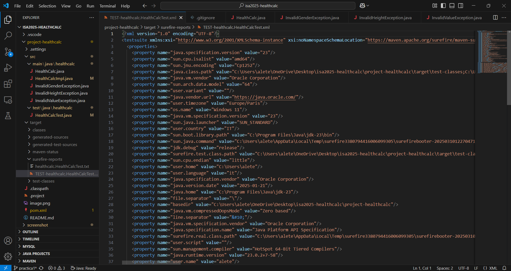
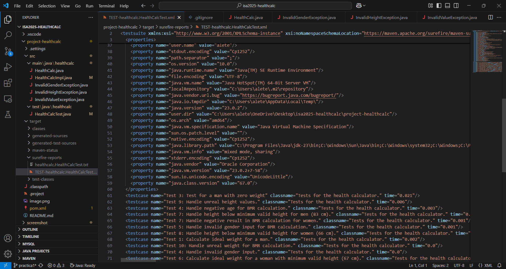
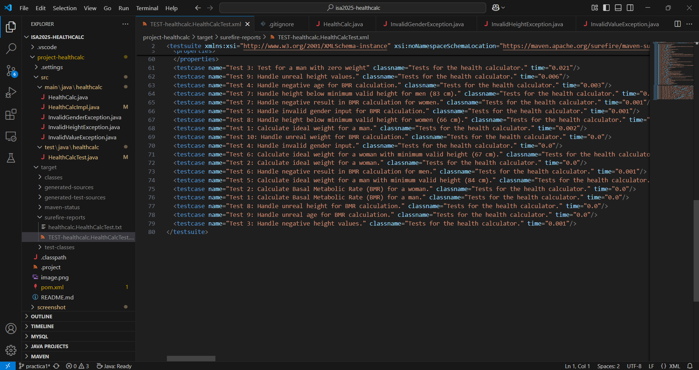

## Commit Screenshot
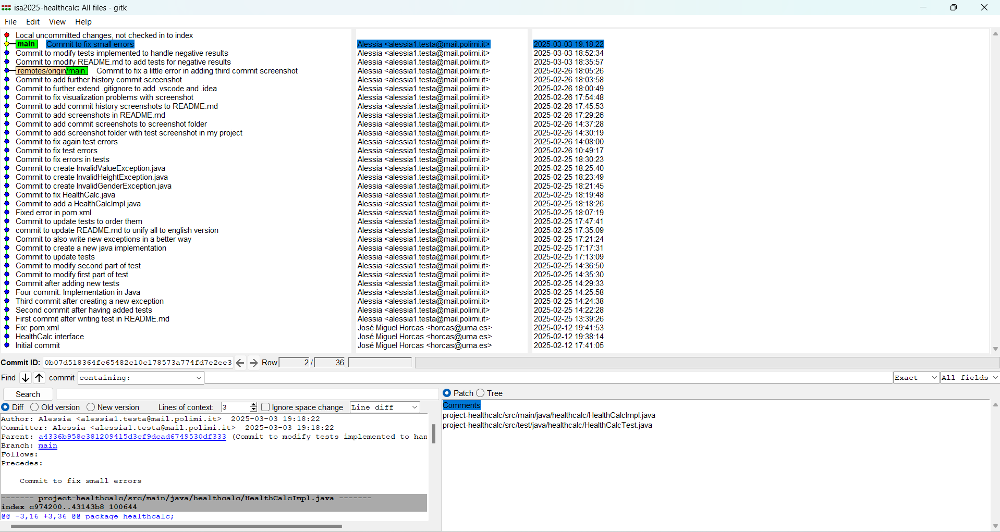
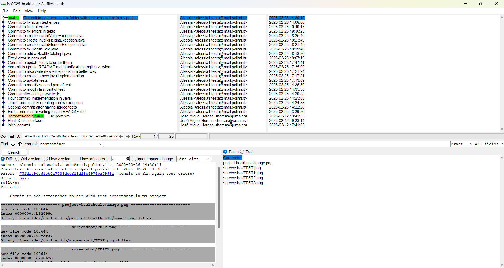
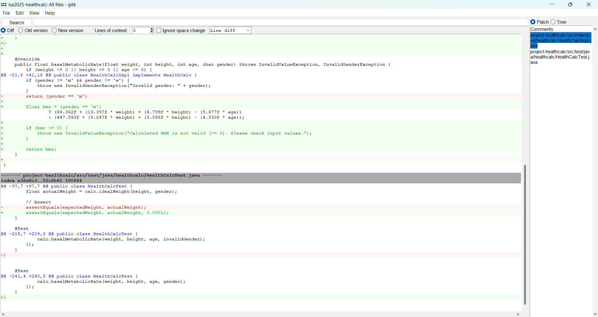

# Practica 4: Interfaz gráfica de usuario

Boceto:
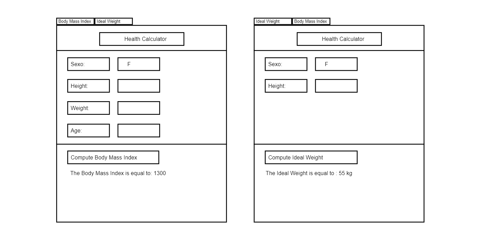
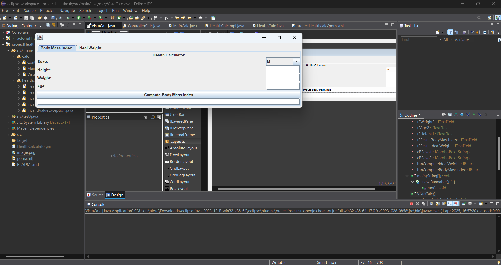

# Práctica 6: Patrones de diseño
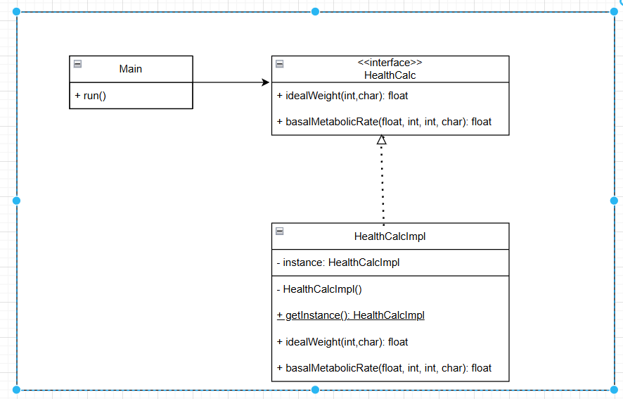
I've done the UML using drawio, but the source could not be downloaded

a. Adapter is used
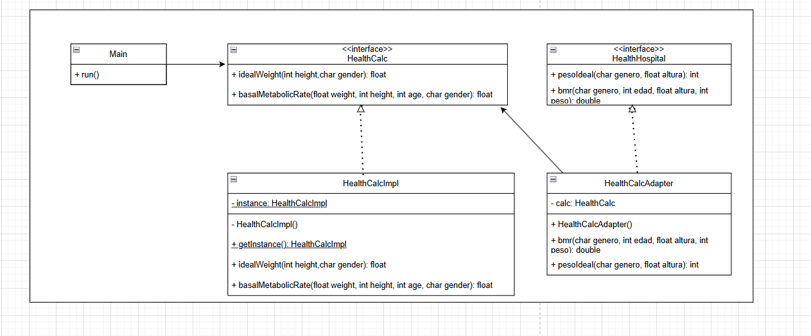

b. Proxy is used
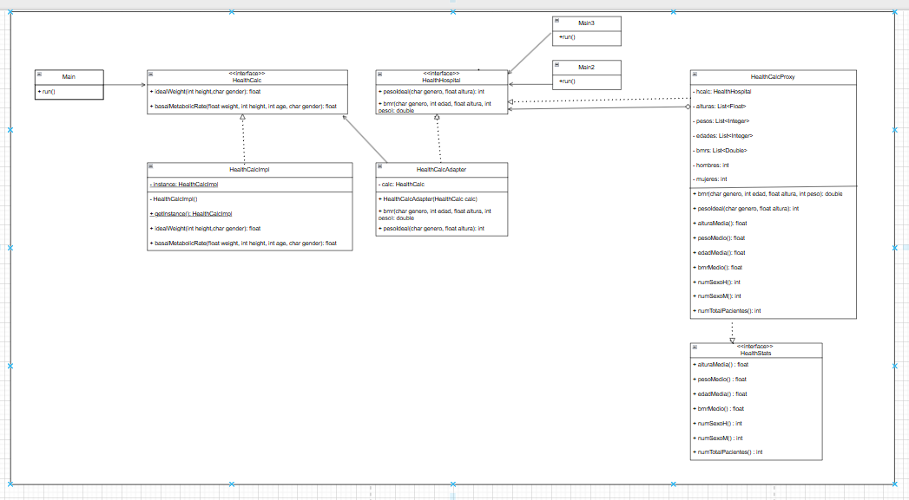

c. Decorator is used
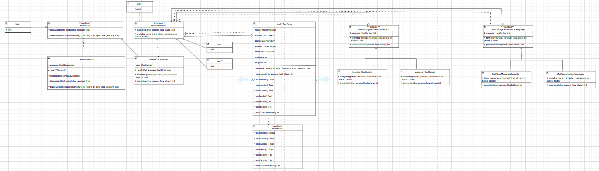

# Practica7: Refactoring

This document outlines the five refactorings applied to improve code readability, maintainability, and domain modeling precision.

---

## 1. Replace Primitive with Enumeration (`Gender`)

- **Bad Smell**: Primitive Obsession
- **Type**: Encapsulation Refactoring
- **Refactoring**: Extract Class (Enum)
- **Category**: Attribute Refactoring

### Description:
The primitive character type used for gender (e.g., `'m'`, `'w'`) has been replaced with an enumeration `Gender`, which defines `MALE` and `FEMALE`. This improves type safety and semantic clarity.

### Manual Changes:
- **1 enum class added**: `Gender.java`
- **8 classes manually updated**: changed parameter type from `char` to `Gender`
- **34 lines of code manually changed**: method signatures, internal conditions, and comparisons

---

## 2. Replace Long Parameter List with Person Object

- **Bad Smell**: Long Parameter List
- **Type**: Encapsulation Refactoring
- **Refactoring**: Introduce Parameter Object
- **Category**: Method Refactoring

### Description:
Replaced repeated use of `(float weight, int height, int age, Gender gender)` in method signatures with a single `Person` object. This encapsulates the related parameters into a cohesive domain object.

### Manual Changes:
- **2 classes added**: `Person.java`, `PersonImpl.java`
- **10 classes manually updated**: replaced individual parameters with `Person`
- **51 lines of code manually changed** (excluding tests)

---

## 3. Extract Class: Split Responsibilities

- **Bad Smell**: God Class / Too Many Responsibilities
- **Type**: Encapsulation + Responsibility Separation
- **Refactoring**: Extract Class
- **Category**: Class Refactoring

### Description:
`HealthCalcImpl` was responsible for both cardiovascular and metabolic calculations. It was split into:
- `CardiovascularMetrics` for ideal body weight
- `MetabolicMetrics` for basal metabolic rate (BMR)

This supports the Single Responsibility Principle and reduces class size.

### Manual Changes:
- **2 classes added**: `CardiovascularMetrics.java`, `MetabolicMetrics.java`
- **1 class updated**: `HealthCalcImpl.java` (delegates to the new classes)
- **4 lines of code changed** in `HealthCalcImpl`
- **No changes required** for other classes or tests

---

## 4. Rename Method: `idealWeight` → `getIdealBodyWeight`

- **Bad Smell**: Method Name Ambiguity
- **Type**: Method Refactoring
- **Category**: Naming Refactor
- **Refactoring**: Change Method Name

### Description:
Renamed method `idealWeight` to `getIdealBodyWeight` to clarify its purpose and make the name more descriptive.

### Manual Changes:
- **0 class added**
- **4 classes updated**
- **5 lines of code changed** (excluding 8 lines in test updates)

---

## 5. Replace Primitive Types: `float` → `double`, `int` → `float` (for height)

- **Bad Smell**: Primitive Obsession
- **Type**: Data Type/Attribute Refactoring
- **Category**: Type Precision
- **Refactoring**: Replace Type

### Description:
Improved numerical precision by replacing:
- Return types of calculations from `float` to `double`
- `int height` in `Person` → `float height`

This aligns with modern standards for health calculations requiring decimal precision.

### Manual Changes:
- **0 class added**
- **6 classes updated**
- **14 lines of code changed** (excluding 5 lines in tests)
- **3 additional lines changed** in:
  - `BMRMessageDecorator.java`
  - `EuropeanHealthCalc.java`
  - `AmericanHealthCalc.java`

These classes were adjusted for compatibility with the updated `float` height.

---
