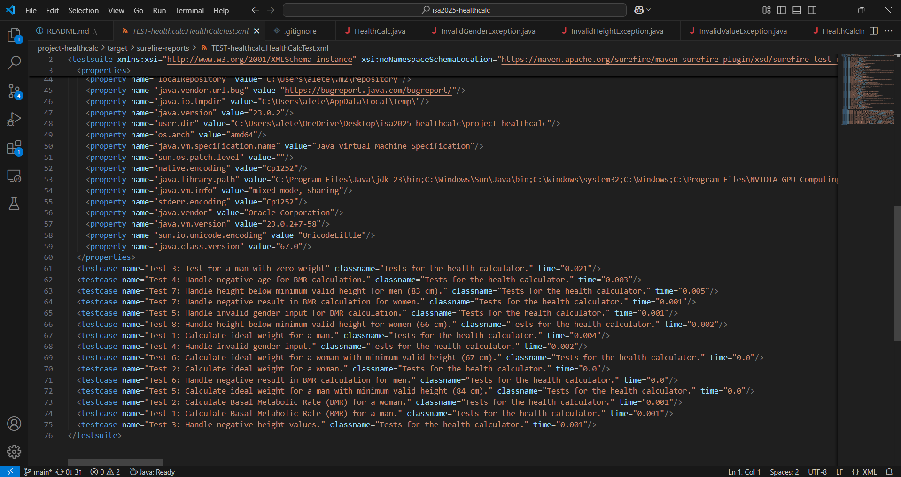
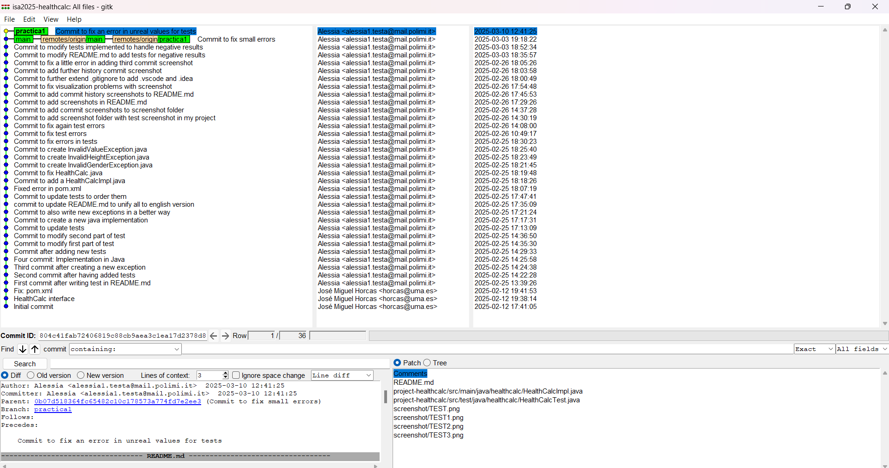
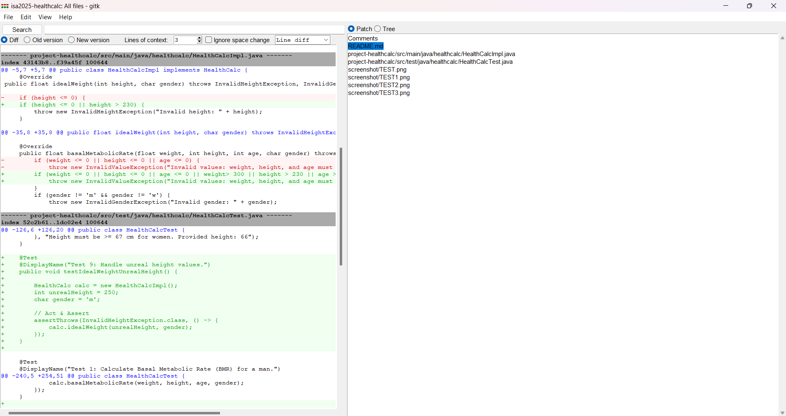
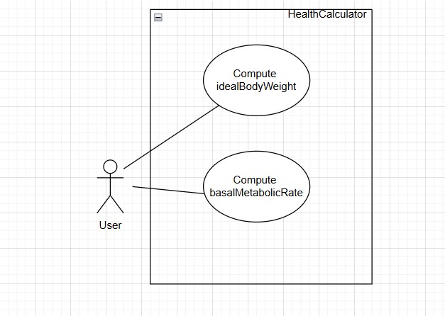

# isa2025-healthcalc
# HealthCalc Project  

## Project Description  
HealthCalc is a Java application that calculates ideal weight and basal metabolic rate (BMR) based on user input. The project follows standard health formulas and is tested using JUnit and Maven.  

private HealthCalc calc;
@BeforeEach
void initialize(){
    calc= new HealthCalcImpl();
}
## 1. Function `idealWeight`

### Description
This function calculates the ideal weight (IW) of a person using the Lorentz formula:
- For men: `IW = height - 100 - (height - 150) / 4`
- For women: `IW = height - 100 - (height - 150) / 2.5`

### Example Tests

#### 1 Test for a man of 175 cm
- **Input:** `height = 175`, `gender = 'm'`
- **Expected Output:** `IW = 175 - 100 - (175 - 150) / 4 = 175 - 100 - 25 / 4 = 175 - 100 - 6.25 = 68.75`
- **Description:** Verifies that the formula for men is calculated correctly.

#### 2 Test for a woman of 160 cm
- **Input:** `height = 160`, `gender = 'w'`
- **Expected Output:** `IW = 160 - 100 - (160 - 150) / 2.5 = 160 - 100 - 10 / 2.5 = 160 - 100 - 4 = 56`
- **Description:** Verifies that the formula for women is calculated correctly.

#### 3 Test for a negative height value
- **Input:** `height = -160`, `gender = 'w'`
- **Expected Output:** Throws `InvalidHeightException`
- **Description:** Verifies that an exception is thrown if the height is negative.

#### 4 Test for an invalid gender value
- **Input:** `height = 160`, `gender = 'x'`
- **Expected Output:** Throws `InvalidGenderException`
- **Description:** Verifies that an exception is thrown if the gender is invalid (not 'm' or 'w').

#### 5 Test for minimum height for men
- **Input:** `height = 84`, `gender = 'm'`
- **Expected Output:** `IW = 84 - 100 - (84 - 150) / 4 = 84 - 100 + 66 / 4 = 84 - 100 + 16.5  = 0.5`
- **Description:** Verifies that the formula for men is calculated correctly also at the minimum height before computing a result that is negative (a negative weight can't exist).

#### 6 Test for minimum height for women
- **Input:** `height = 67`, `gender = 'w'`
- **Expected Output:** `IW = 67 - 100 - (67 - 150) / 2.5 = 67 - 100 + 83 / 2.5 = 67 - 100 + 33.2 = 0.2`
- **Description:** Verifies that the formula for women is calculated correctly also at the minimum height before computing a result that is negative (a negative weight can't exist).

#### 7 Test for an invalid range number for the height in input for men
- **Input:** `height = 83`, `gender = 'm'`
- **Expected Output:** Throws `InvalidHeightException`
- **Description:** Verifies that an exception is thrown if the height is below 84 for men.

#### 8 Test for an invalid range number for the height in input for women
- **Input:** `height = 66`, `gender = 'w'`
- **Expected Output:** Throws `InvalidHeightException`
- **Description:** Verifies that an exception is thrown if the height is below 67 for women.

## Function `basalMetabolicRate (BMR)`

### Description
This function calculates the Basal Metabolic Rate (BMR) of a person using the Harris-Benedict formula:
- For men: `BMR = 88.362 + 13.397 * weight + 4.799 * height - 5.677 * age`
- For women: `BMR = 447.593 + 9.247 * weight + 3.098 * height - 4.330 * age`
Here I can accept negative values, because the BMR can be negative. 
### Example Tests

#### 1 Test for a man with weight 80 kg, height 175 cm, and age 30
- **Input:** `weight = 80`, `height = 175`, `age = 30`, `gender = 'm'`
- **Expected Output:** `BMR = 88.362 + 13.397 * 80 + 4.799 * 175 - 5.677 * 30 = 1829.637`
- **Description:** Verifies that the BMR for men is calculated correctly.

#### 2 Test for a woman with weight 60 kg, height 160 cm, and age 25
- **Input:** `weight = 60`, `height = 160`, `age = 25`, `gender = 'w'`
- **Expected Output:** `BMR = 447.593 + 9.247 * 60 + 3.098 * 160 - 4.330 * 25 = 1389.843`
- **Description:** Verifies that the BMR for women is calculated correctly.

#### 3 Test for a man with zero weight
- **Input:** `weight = 0`, `height = 175`, `age = 30`, `gender = 'm'`
- **Expected Output:** `BMR = 88.362 + 13.397 * 0 + 4.799 * 175 - 5.677 * 30 = 757.877`
- **Description:** Verifies that the BMR calculation handles the case where weight is zero.

#### 4 Test for a person with a negative age
- **Input:** `weight = 70`, `height = 160`, `age = -5`, `gender = 'w'`
- **Expected Output:** Throws `InvalidValueException`
- **Description:** Verifies that an exception is thrown if the age is negative.

####  5 Test for an invalid gender input in BMR calculation
- **Input:** `weight = 70`, `height = 160`, `age = 30`, `gender = 'x'`
- **Expected Output:** Throws `InvalidGenderException`
- **Description:** Verifies that an exception is thrown if the gender is invalid (not 'm' or 'w').

####  6 Test for a negative result in BMR calculation for men
- **Input:** `weight = 1`, `height = 1`, `age = 20`, `gender = 'm'`
- **Expected Output:** Throws `InvalidValueException`
- **Description:** Verifies that an exception is thrown if the input values lead to a negative BMR for men.

####  7 Test for a negative result in BMR calculation for women
- **Input:** `weight = 1`, `height = 1`, `age = 107`, `gender = 'w'`
- **Expected Output:** Throws `InvalidValueException`
- **Description:** Verifies that an exception is thrown if the input values lead to a negative BMR for women.

## How to Run the Tests  
To execute the tests using Maven, run the following command in the terminal:  

mvn test

## Test Screenshot

## Commit Screenshot

## UML Screenshot
This is the UML of the health calculator at the beginning.

